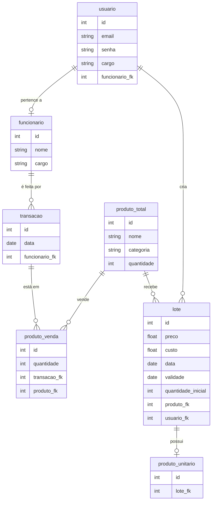

# Modelo Conceitual

```mermaid
erDiagram
    usuario {
        int id
        string email
        string senha
        string cargo
        int funcionario_fk
    }

    funcionario {
        int id
        string nome
        string cargo
    }
    usuario ||--o| funcionario : "pertence a"

    transacao {
        int id
        date data
        int funcionario_fk
    }
    funcionario ||--o{ transacao : "é feita por"

    produto_venda {
        int id
        int quantidade
        int transacao_fk
        int produto_fk
    }
    transacao ||--o{ produto_venda : "está em"
    produto_total ||--o{ produto_venda : "vende"

    produto_total {
        int id
        string nome
        string categoria
        int quantidade
    }

    lote {
        int id
        float preco
        float custo
        date data
        date validade
        int quantidade_inicial
        int produto_fk
        int usuario_fk
    }
    produto_total ||--o{ lote : "recebe"
    usuario ||--o{ lote : "cria"

    produto_unitario {
        int id
        int lote_fk
    }
    lote ||--o| produto_unitario : "possui"
```
