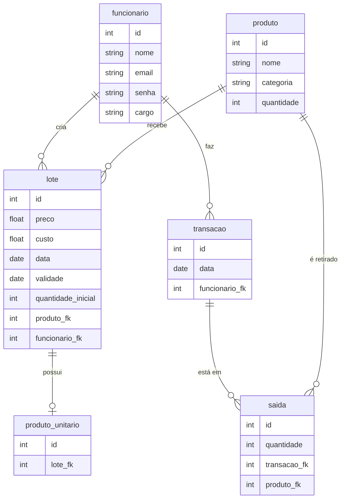

# Modelo Conceitual

```mermaid
erDiagram
    funcionario {
        int id
        string nome
        string email
        string senha
        string cargo
    }

    transacao {
        int id
        date data
        int funcionario_fk
    }

    saida {
        int id
        int quantidade
        int transacao_fk
        int produto_fk
    }

    produto_unitario {
        int id
        int lote_fk
    }

    lote {
        int id
        float preco
        float custo
        date data
        date validade
        int quantidade_inicial
        int produto_fk
        int funcionario_fk
    }

    produto {
        int id
        string nome
        string categoria
        int quantidade
    }

    funcionario ||--o{ lote : "cria"
    lote ||--o| produto_unitario : "possui"
    funcionario ||--o{ transacao : "faz"
    transacao ||--o{ saida : "está em"
    produto ||--o{ lote : "recebe"
    produto ||--o{ saida : "é retirado"
```
